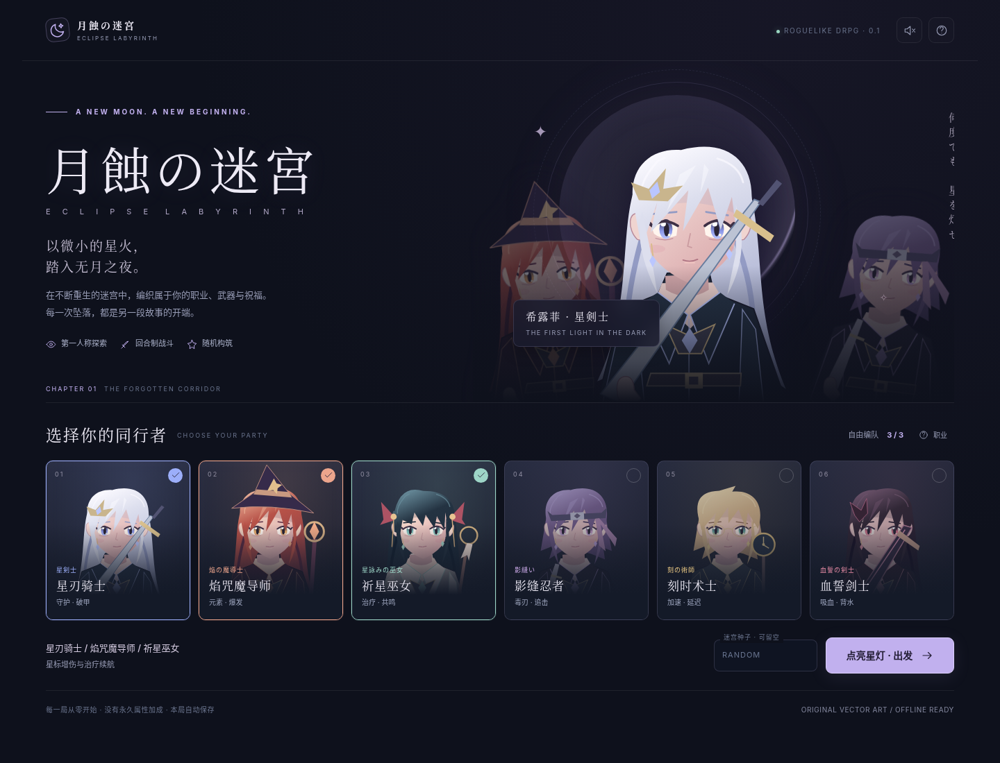
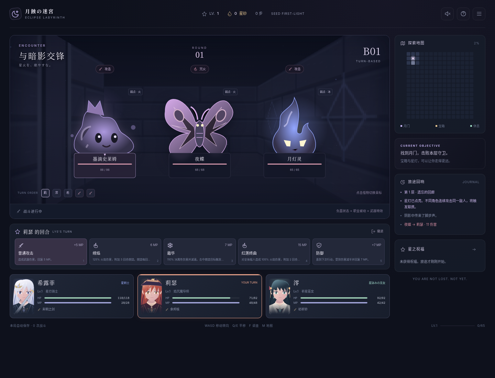

# 月蝕の迷宮 · Eclipse Labyrinth

**日式幻想风格 / 第一人称 DRPG / 回合制战斗 / 每局从零的 Roguelike**

以微小的星火，踏入无月之夜。

可独行，也可组成最多三人的小队。在每次重新生成的五层迷宫里，寻找武器、技能觉醒与星之祝福，击败守门者，最后面对无月王座上的首领。游戏界面以中文为主，日文用于氛围与职业副标题。



## 直接游玩

下载后，用桌面浏览器打开 **`dist/index.html`**。这是完整的单文件离线版，不需要 Node.js、安装依赖、API Key 或互联网连接。不要直接双击项目根目录的开发版 `index.html`，它使用 ES Modules，需要 HTTP 服务。

本局会自动保存到浏览器。不同浏览器、不同来源地址之间的存档不互通；隐私模式或浏览器限制本地文件存储时可能无法保存。最稳定的开发游玩方式是启动下述本地服务器。移动端已经做了窄屏布局与按钮操作，但本版本没有宣称完成真机 Safari 兼容认证。

## 开发运行

需要 Node.js 20 或更高版本。项目没有 npm 依赖，**不需要 `npm install`**。

```sh
npm run dev
```

浏览器打开 `http://127.0.0.1:5173`。默认只监听本机，不会把游戏自动暴露到公网。

```sh
npm test             # 引擎和发布安全测试
npm run build        # 重新生成单文件 dist/index.html
npm run check        # 测试 + 构建
```

## 已实现的玩法

| 系统 | 内容 |
| --- | --- |
| 地牢 | 5 层随机迷宫；有环路、房间、战争迷雾、宝箱、精英、休息点、神像与守门战 |
| 探索 | 第一人称网格移动、90°转向、侧移；Canvas 光线投射渲染与景深遮挡 |
| 编队 | 6 个可选职业，1～3 个不同职业；单人专属补正，敌人按人数调整 |
| 战斗 | 按速度安排回合，显示敌人意图；单体/群体攻击、治疗、复活、防御、撤退 |
| 成长 | 每场胜利或宝箱三选一；随机属性祝福、武器、职业技能强化 |
| 装备 | 仅有武器槽；18 把武器，各自只有一个固有效果；所有职业可使用任意武器 |
| 技能 | 18 个职业主动技能，强化上限 +3；6 种职业被动 |
| 祝福 | 12 种可叠加祝福，包括属性、吸血、持续伤害、暴击与联携强化 |
| 一局结束 | 全队倒下结束；第五层首领胜利通关；重新开始清空全部局内成长 |
| 存档与音画 | 本地保存当前局；原创 SVG 角色/怪物/物件；程序化迷宫与合成音乐，声音默认关闭 |

## 职业不是只能承担单一职责

| 职业 | 独立作战方式 | 组队联动 |
| --- | --- | --- |
| 星刃骑士 | 破甲、减伤、自疗、群攻 | 先破甲，再让忍者或剑士打出物理爆发 |
| 焰咒魔导师 | 普攻按魔力结算，燃烧、融解、群攻 | 提供负面状态，让忍者追加伤害；消耗后用普攻/防御回 MP |
| 祈星巫女 | 光系输出附带治疗，群体治疗、复活 | 星标提升全队对目标的伤害，兼顾续航 |
| 影缝忍者 | 毒伤、高速、自疗、状态增伤 | 追击被燃烧、破甲、减速或星标的敌人 |
| 刻时术士 | 魔力普攻、减速、治疗、每回合回 MP | 全队加速，治疗与净化，调整后续回合节奏 |
| 血誓剑士 | 攻击吸血、低血量增伤、以血换 MP | 接骑士破甲；在队友保护与治疗下维持高输出 |

单人会获得生命 +45%、MP +30%、伤害 +25% 的「独行誓约」。职业不同不意味着每种起手都一样轻松；属性、武器和休整路线仍需要权衡。本版是可玩的首版，尚未完成长期数值平衡调优，也没有保证所有随机种子必胜。

### 武器效果示例

「未明之剑」命中有机会破甲；「双生誓言」有机会追击；「第十三刻」强化前两回合输出；「永恒的安可」每场战斗一次返魂；「创世时计」降低 MP 消耗；「葬月挽歌」击杀恢复生命与 MP。换武器不会更换职业，旧武器会进入行囊，战斗中不可换装。



## 操作

| 操作 | 键盘 / 鼠标 |
| --- | --- |
| 前进 / 后退 | W / S 或 ↑ / ↓ |
| 左转 / 右转 | A / D 或 ← / → |
| 左右侧移 | Q / E |
| 调查脚下事件 | F / Enter；也可点击提示 |
| 地图 / 行囊 | M / I |
| 战斗指令 | 点击，或 1～5 |
| 选择敌人 | 点击怪物 |
| 单体治疗对象 | 选择技能后，点击下方队友 |
| 说明 / 菜单 | H / Escape；也可用右上角按钮 |

普通攻击回复 5 MP；防御回复 7 MP 并减轻伤害。地图事件必须站到对应格子后调查。守卫击败后，**再次调查月门**才会进入下一层；并非杀完所有敌人才能下楼。

## 发布到 GitHub 私密仓库

目标账号：**`geturin`**。默认仓库名：**`eclipse-labyrinth`**。

**源码包本身不表示已在 GitHub 创建仓库。** 本次交付包含发布脚本，但交付环境的 GitHub 连接没有写入接口，因此远程创建和推送没有在交付时执行。

在本机安装 Git、Node.js 和 GitHub CLI，将源码包解压到不属于其他 Git 仓库的新目录，然后运行：

```sh
gh auth login --hostname github.com --web --git-protocol https
node scripts/publish.mjs
```

脚本检查账号、运行测试和构建，创建 **private** 仓库，读取并确认私密性与所有者后才上传，再校验远端提交。不会创建公开仓库、启用 Pages、覆盖已有仓库、强制推送或更改全局 Git 设置。登录操作使用 GitHub CLI 自身的安全登录流程，不要把凭据写进代码或聊天。

更多说明，包括仓库重名、仅检查和中断恢复，见 [docs/PUBLISH.md](docs/PUBLISH.md)。

## 源码结构

```text
src/data.js          职业、技能、武器、祝福、敌人、状态和层主题
src/engine.js        确定性 RNG、迷宫生成、战斗、成长、保存恢复
src/renderer.js      第一人称 Canvas 光线投射渲染
src/art.js           原创 SVG 角色、敌人、物件和图标
src/audio.js         Web Audio 合成音乐与音效
src/app.js           UI、键盘/触屏交互、弹窗、存档接线
style.css            桌面与移动端布局
scripts/build.mjs    项目专用的零依赖单文件打包器
scripts/serve.mjs    本地开发 HTTP 服务
scripts/publish.mjs  首次发布私密仓库的安全脚本
```

[玩法与实现设计](docs/GAME_DESIGN.md) · [测试范围与限制](docs/QA.md) · [Agent 维护入口](AGENTS.md)

本项目没有遥测、广告、付费服务、登录后端或第三方素材请求。角色、怪物与界面素材为本项目原创矢量图形；没有导入《最终幻想》系列的人物、图像、音乐或游戏数据。职业设计借鉴的是独立作战与队伍配合的思路，而不是战棋地图或其完整转职系统。
